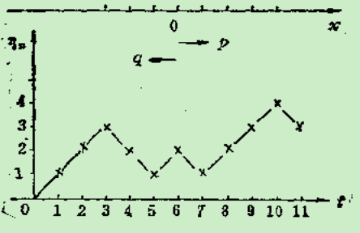
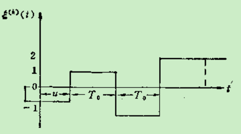
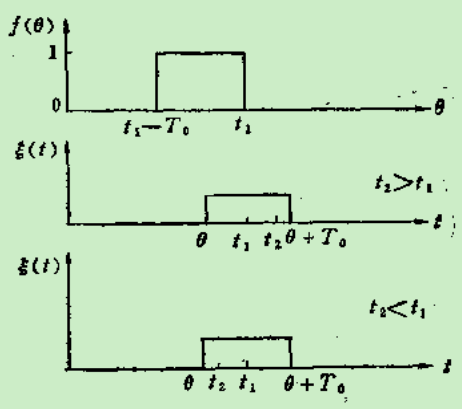
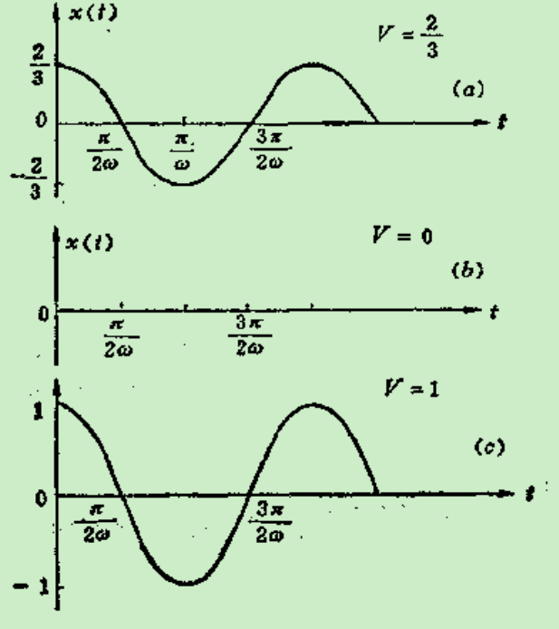
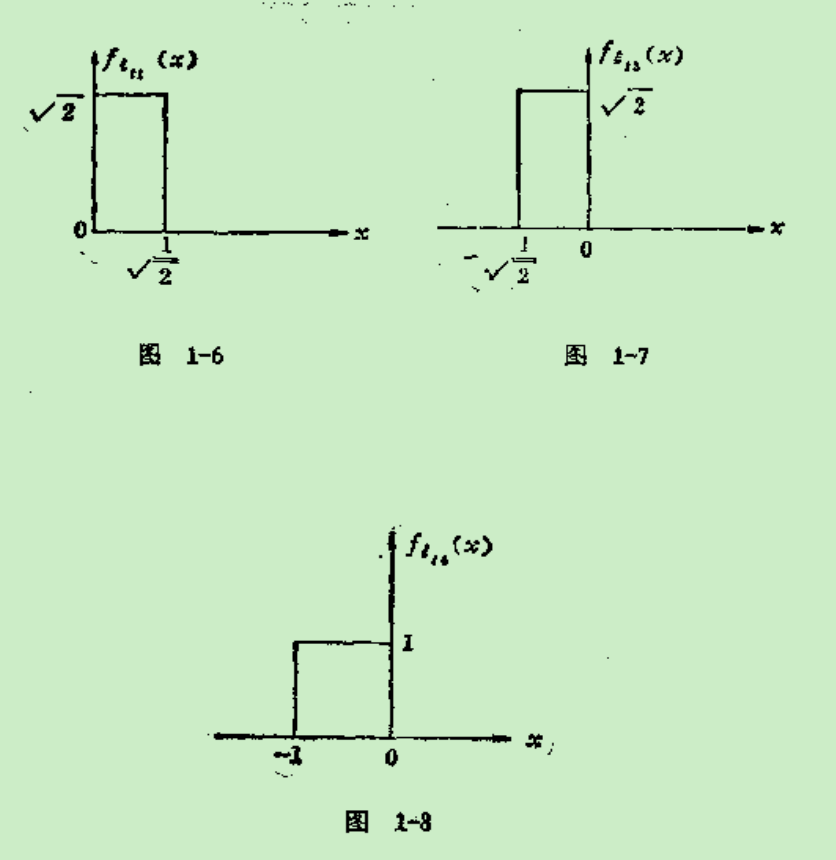
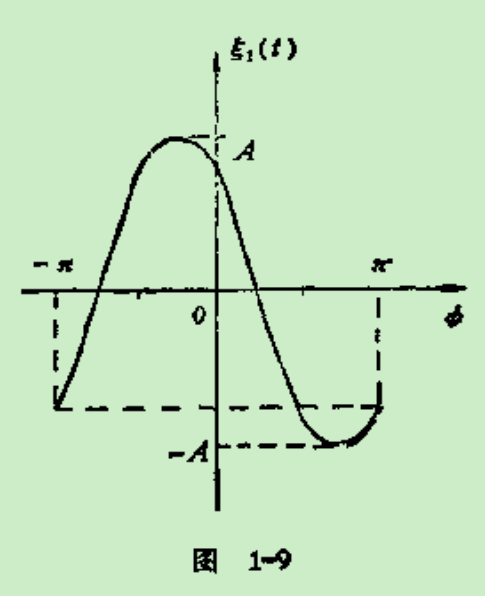
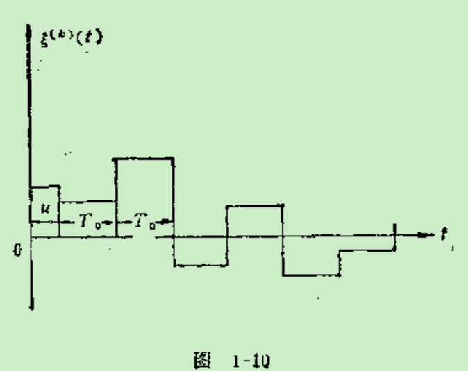

前言

近年来,作者为清华大学无线电电子学系以及有关专业的研究生、无线电子学系的本科高年级学生开设了“随机过程”课程,同时编写了这方面的参考教材。本书就是在此基础上编写而成的。

随机过程已广泛应用于许多领域中,如物理、生物、社会科学(管理、经济)以及工程科学技术中,并且在这些领域中显示出十分重要的作用。本书将着重讨论随机过程的基本研究方法,并介绍应用中常遇到的几种基本随机过程,对某些应用,尤其是在控制和电子技术中的应用作了根应的介绍

考虑到学生在学习本课程之前已学过概率论的基本内容,但又可能还不够深入和熟练,因此,本书在某些章节中,为了引出过程的概念对概率论的基本内容作一些讨论,如对多元随机变量、维正态分布的讨论又如在研究马尔可夫过程中不断地回顾概率论的基本内答,并在删录中加入了一段“特征函数”。

在学习本课程之前,学生一般已经掌握了对确定性函数(倌号)的研究分析方法。本书采用平行于分析研究确定性函数〔信号)时使用的方法,确立一套相应的对随机过程的研究分析方法,如随机分析、谱分析,又如把大家所熟知的傅氏变换用于研究宽平稳过程等等。

全书共分七章。第一章提出随机过程的两类基本分析方

 

 

 

#第一章概论

##§1 随机过程

在自然界中事物的变化过程可以分为两大类。第一类具有确定形式的变化过程，或者说具有必然变化规律用数学语言来说，就是事物的变化过程可以用一个时间t的确定函数来描述。这类过程称为确定性过程。例如电容器通过电阻放电时，电容两端的电位差随时间的变化就是一个确定性函数。而另一类过程没有确定的变化形式，也就是说，每次对它的测量结果没有一个确定的变化规律，用数学语言来说，这类事物的变化过程不能用一个时间t的确定性函数来描述。如果对该事物的变化过程重复地独立地进行多次观察，则每次所得到的结果是不相同的。从另一角度来看，如果固定某一观测时刻t，事物在时刻t出现的状态是随机的。这类过程称为随机过程。

自然界有许多属于随机性质的过程，例如:

(1)在电话问题中，我们用ξ(t)表示在时刻t前电话局接到的呼唤次数。如果固定t，则ξ(t)显然是一个随机变量。但是t是可变参数，是一个连续变量，所以ξ(t)又是一个过程。因此，这个问题所涉及的不仅是一个随机变量的问题，它既是随机的，又是一个过程。

(2)在波耳氢原子模型中，电子可以在允许的轨道之一上运动。我们用"ξ(t)=i"表示"在t时刻电子是在第i条轨道上运动"的事件。电子可以从一条轨道跃迁到另一条轨道上(即从第i轨道跃迁到第j轨道)，而跃迁到哪一条轨道上是随机的，跃迁到的时刻 t~1~，t~2~，…也是随机的。因此经过t时间后，电子所处的轨道ξ(t)是随机的。

(3)液面上质点的运动。观察液面上一个作布朗运动的质点A。若用{ξ(t)，η(t)}表示在时刻t该质点在液面上坐标位置,显然,当固定t 时,{$\xi(t),\eta(t)$}是一对二维机变量。但是t是一个连续变量,因此{ξ(t)，η(t)}又是个过程。

以上三个例子都说明需要在事物的变化过程中研究它的状态。

​       我们用“随机过程”一词来表示依赖于一个变动参量的一族随机变量。

虽然随机过程不能用一个确定性的函数来描述,但是随机过程也是有规律的。我们的任务就是研究如何描述一个随过程,即研究随机过程的性质和规律。

先从三个例子开始,说明如何描述一个随机过程。

(1)伯努利过程

以掷硬币为例。设想每隔单位时间掷一次硬币,观察它出现的结果。如果出现正面,记其结果为1;如出现反面, 其结果为0。一直抛掷下去,便可得到一无穷序列{x~1~, x~2~,x~3~,…},则

{x~1~, x~2~,x~3~,…}={x~n~;n=1, 2,…;x~n~=1或0} 

因为每次抛掷的结果xn是一个随机变量(1或0),所以无穷次抛掷的结果是一随机变量的无穷序列。称随机变量的序可为随机序列,也可称为随机过程。每次抛掷的结果与先后各次抛掷的结果是相互统计独立的,并且xn出现 0或1的概率与抛掷的时间n无关。设

P{x~n~=1}=第n次抛掷出现正面的概率=p 

P{x~n~=0}=第n次抛掷出现反面的概率=q=1-p

其中P{x~n~=1}=p与n无关,且x~i~、x~k~(i≠k时)是

相互统计独立的随机变量。称具有这种特性的随机过程为伯努利型随机过程。

有许多实际问题是可以用伯努利概率模型来描述的。如在数字通信中所传送的信号是脉冲信号,在某一时刻t~可能~

出现脉冲,也可能不出现脉冲,出现脉冲称为1,不出现脉冲称为0,则在t时刻信号的值xt是一个随机变量,即xt有二个状态,0或1。如果在t~1~,t~2~,t~3~,…时观察信号,则所得结果是{x~1~,x~2~,x~3~,…}={x~n~；n=1,2,3,…; x~n~=1或0}。如果在t时刻出现1或0的概率和观察的时刻t无关,在t~i~出现x~i~与其他任何时刻t~k~出现x~k~是相互统计独立的,并设P{xk=1}=p, P{x~k~=0}=q=1-p,则p与k无关,且x~i~、x~k~(i≠k时)是相互统计独立的随机变量, 这样形成的随机序列属于伯努利概型。

在伯努利概型的随机过程中,如果固定观测时刻 t,则它的试验结果是属于二个样本点(0,1)所组成的样本空间$S_{x_{\scriptsize i}}​$如果在二个不同时刻t~1~、t~2~观测试验结果,则 x~1~、x~2~可能出现的值为(0,0),(0,1),(1,0), (1,1),其样本空间为$S_{x_{\scriptsize 1}}​$× $S_{x_{\scriptsize 2}}​$,样本点为2^2^=4个。{x~1~,x~2~}是一个二维随机变量, 或二维随机矢量。

同理,如果在t~1~,t~2~,…,t~n~观察其所取的值(x~1~,x~2~ ,…,x~n~),便可得到一个n维随机矢量,其样本空间为$S_{x_{\scriptsize 1}}​$× $S_{x_{\scriptsize 2}}​$×…×$S_{x_{\scriptsize n}}​$,在该样本空间中包括从(0,0,…0)到(1,1,…,1)的2^n^个样本点。

于是,如果在t~1~,t~2~,…观察其所取的值x~1~,x~2~ ,…,则可得到一个无穷维的随机矢量,其样本空间为

$S_{x_{\scriptsize 1}}$× $S_{x_{\scriptsize 2}}$×…×$S_{x_{\scriptsize n}}$×…

(2)正弦波过程

在振荡源的大批生产中抽出其中一台振荡器,它的输出波形为

x(t)=$\nu​$sin(ωt+ψ)

其中$\nu$为振幅,ω为振荡角频率,ω=2πf,f为振荡频率,为振荡的起始相角。出于生产中的不一致性,各振荡器的振幅和频率与额定的指标均有一定的允许偏差,各台的偏差是不一致的,也就是说,$\nu$、ω是随机变量,每一台

的$\nu$、ω是样本空间(V、Ω)中的一个样本点,而且每次把振荡器接上电源,振荡的起始相角ψ也是随机的,ψ也有一个样本空间φ。因此每次对一台振荡器作试验,其输出电压的$\nu$、ω、ψ是样本空间(V、Ω、Φ)中的一个点。当然,输出电压还是一个时间函数。不同的振荡器在各次试验中其输出电压的时间函数虽然均是正弦波,但因ν、ω、ψ为随机变量,不同台不同次的输出可能均不相同。如果固定一个观测时刻,观察各台振荡器在这一时刻的电压,由于ν、ω、ψ是随机变量,且

x(t)=$\nu​$sin(ωt+ψ)

故x(t)也是随机变量。在t时x(t)的分布决定于t以及$\nu$、ω、ψ的分布。

称x(t)=$\nu$sin(~ωt+ψ~)为正弦波随机过程,在这个过程中,t是一个参量,它可以取[0,$\infty$)内的任意值。

（3）如对晶体管的噪声电乎进行测量,每隔单位时间（假定为1微秒）取一个样本,则可在时刻t=1,2,3,…,n,…测得一族无穷可列维随机矢量{ξ~1~ ξ~2~…ξ~n~…}一次测量的结果为样本空间的一个点,每次测试的转果可能各不相同。我们把每次测试的结果称为一个现实,或称为一个样本函数。另一方面,如果固定一个观测时刻,对噪声进行无穷次测量,则可得到该时刻噪声的分布。如银固定二个时刻,则测得该二个时刻噪声(二维随机变量)的二元分布。如果固定n个时刻,则可测得n个时刻噪声(n维随机矢量)的n维分布。

从上述三个例子中看到有二种描述随机过程的方法：

（1）固定时刻t,随机过程(在该时刻所取的值是一随机变量。对应每一个随机变量,有一概率空间(Ω、$\mathscr{F}$、P),即ξt(ω)=ξ(ω,t)是样本空间ω∈Ω内的一个随机变量, 可用分布函数F~t~(x)=F(x;t)=P{ξt (ω)<x}=P{ξ ~t~(ω,t)<x}来描述ξ (ω,t)。这是一维分布。这种描述只能说明在某一时刻ξ(ω,t)的分布,而不能描述不同时刻ξ (ω,t)的相互关系。为了描述随枳过程{ξ(t),t∈T}在不同时刻的相互关系,就要求用n维联合分布函数来描述n个不同时刻t~1~,t~2~,…,t~n~。相对应的n个随机变量ξ(t~1~), ξ(t~2~),…, ξ(t~n~)。

$F_{t_{\scriptsize 1}}{_,}_{t_{\scriptsize 2}}{_,}...{_,}_{t_{\scriptsize n}}​$（x~1~,x~2~,…,x~n~）

=$F​$(x~1~,x~2~,…,x~n~; t~1~,t~2~,…,t~n~)

=P{ξ(t~1~)<x~1~, ξ(t~2~)<x~2~,…, ξ(t~n~)<x~n~}

其中n是任意选定的, t~1~,t~2~,…,t~n~是T中的n个元素。

由于上式中n及t~1~,t~2~,…,t~n~都是任意选定的,因此要求给的是一族有限维分布函数。可以看出,这一族有限维分和数不仅刻划出了对应于每一个时刻t的随机变量ξ(t)的统计规律性，而且也刻画出了不同时刻t~i~、t~k~的ξ(t~i~)、ξ(t~k~)间的关系。因此，随机过程ξ(t)的统计规律性可由它的有限维分布函数族完整地描述出来。称这一有限维分布函数族为随机过程{ξ(t),t∈T}的有限维分布函数族。

这里需要说明如下两点：

①为了简便起见，往往把{ξ(t),t}简写为ξ(t)。

②有时把随机过程ξ(t)在t=t~k~所取的值x(t~k~)成为随机过程ξ(t)在t=t~k~时的状态。

2)对于特定的ωk∈Ω,即对于一个特定的试验结果,ξ^(k)^(t)是一个确定的样本函数,它可以理解为随机过程的一次实现。有时为了避兔混淆第k个实现可用x~k~(t)表示之。由于x~k~(t)是一次实现,它可以通过测量而得到。例如在正弦波过程的一次试验中,$\nu$、ω、ψ均为一个确定的值,因此一次试验得到的现实为一正弦函数。

这两种描述方法是互为补充的。由于随机过程可以用一族有限维分布函数描述,因此可以利用研究随机矢量的方法研究随机过程。

概括上面述二种描述方法,可以对随机过程作一个概括的说明。

**定义**:设(Ω、$\mathscr{F}$、P)是概率空间,T是直线上的参数集(可列或不可列的),若对每一个t∈T,ξ(ω,t)是随机变量,则称传{ξ(ω,t),t∈T}为该概率空间上的随机过程。

随机过程是一个统称,有时这一名词专指T是连续的场合。若{t∈T}取离散值时称为随机序列(或时间序列)。把一次试验结果x~k~(t),t∈T,称为随机过程的一个实现或一个样本。

参数集T在许多实际问题中往往指的是时闻参数,如上述的三个例子。但是也可以采用其他物理量如长度作为参数集。例如,考虑长度为L的棉条的横截面,若用A(x)表示在x处的棉条横截面积,则对于固定的x,A(x)是一随机变量。在n个不同距离x~1~,x~2~,…,x~n~处对应的横截面积A(x~1~),A(x~2~),…,A(x~n~)组成一n维随机矢量,即A(x)是个随机过程。

#§2随机过程的分类和举例

根据参数集T的性质,随机过程可分为两大类：

（1）参数集T是一个可列集,如

T~1~={0,1,2,…}

T~2~={…,-2,-1,0,1,2,…}

§1中的伯努利过程就是属于这一类的随机过程。称这类过程为离散参数随机过程或随机序列。

（2）参数集T是一个不可列集,如

T~3~={t/t≥0},T~4~={t/-∞<t<∞}

这类过程称为连续参数随机过程。

另一方面也可以据ξ(t~k~)所取值(即状态)的特征,把随机过程分为两大类。(1)离散状态,即ξ(t~k~)所取的值是离散的(2)连续状态,即ξ(t~k~)所取的值在一个范围内是连续的。

所以随机过程可分为四大类:

（1）离散参数离散型随机过程

这类过程的特点是参数集为离散的,同时固定t~k~、ξ(t~k~)所取的值(状态)也是离散的。伯努利过程属于这一类。

**例一**、一维随机游动的研究。设有一质点在x轴上作随机游动,即在t=0时质点属于x轴的原点0,在t=1,2,3,…时质点可以在x轴上正向或反向移动一个单位距离,作正向移动一个单位距离的概率为p,作反向移动一个单位距离的概率为q=1-p。经时间n,质点偏离原点的距离为k,问处于k的概率如何?

**解**       设质点每次移动的距离为ξ~i~，ξ~i~可取+1,也可取-1,即

​	P{ξi=+1}=p

​	P{ξi=-1}=q
=1-p

​                       						\<center\>图1-1\</center\>

设质点在t=n时,偏离原点的距离为η~n~,η~n~也是一随机变量,于是

η~n~=   而η~0~=0

又设质点每次游动t与该质点所处的位置无关,当i≠k时ξ~i~和ξ~k~是相互统计独立的随机变量。图1-1画出了η~n~的样本函数。

当n=1时,质点可取的位置为η~1~=1或们η~1~=-1,而

​	P{η~1~=1}=P{ξ~1~=1}=p

​	P{η~1~=-1}=P{ξ~1~=-1}=q=1-p

当n=2时，质点可能取的位置为2,0,-2,而

​	P{η~2~=2}=P{ξ~1~=1,ξ~2~=1}=P{ξ~1~=1}P{ξ~2~=1}=p^2^

​	P{η~2~=0}=P{ξ~1~=1,ξ~2~=-1}+P{ξ~1~=-1,ξ~2~=1}

​		=P{ξ~1~=1}P{ξ~2~=-1}+P{ξ~1~=-1}P{ξ~2~=1}=2pq

​	P{η~2~=-2}=P{ξ~1~=-1,ξ~2~=-1}=P{ξ~1~=-1}P{ξ~2~=-1}=q^2^

依此类推，当t=n时，质点可能取的位置为n,n-2,n-4,…,-(n-4),-(n-2),-n。

如果在n次游动中有m次质点正向移动，即有m次ξ~i~=+1，则有n-m次质点做反向移动，即有n-m次ξ~i~=-1。此时

$$
\eta_{\mathrm{n}}=\sum_{i=1}^{\mathrm{n}} \xi_{i}=m(+1)+(n-m)(-1)\\
=2 m-n=k \quad  或{}  m=-\frac{n+k}{2}
$$
故       
$$
P\{\eta_n=k\}=\left( \begin{array}{l}{{n}} \\ {{m}}\end{array}\right) {p}^{m} {q}^{n-{m}}
$$

$$
=\left(\begin{array}{l}{n}\\{\frac{n+k}{2}}\end{array}\right) \cdot p^{\frac{n+k}{2}} q^{-\frac{n-k}{2}}
$$
上式中m是一正整数，则如n为奇数，k也是奇数，k<n。如n为偶数，k也是偶数，k<n。

(2)连续参数离散型随机过程

这类过程的特点是参数集T是连续的,而在某一时刻,$\xi$(t~k~)所能取的值(即状态)是离散型的。

**例二**  设有一脉冲数字通信系统,它传送的信号是脉宽为T~0~的脉冲信号,每隔T~0~送出一个脉冲。脉冲幅度ξ(t)是一个随机变量,它可取四个值(+2,+1,-1,-2),且取这四个值的概率是相等的,即

P{ξ(t)=+2}=P{ξ(t) =+1}= P{ξ(t) =-1}= P{ξ(t) =-1}= $\frac{1}{4}$

不同周期内脉冲幅度是相互统计独立的,脉冲的起始时间相对于原点(t=0)的时间差u为均匀分布在(0,T~0~)内的随机变量。试求在两个时刻t~1~,t~2~该随机过程ξ(t)所取值ξ(t~1~),ξ(t~2~)的二维联合概率密度。

\<center\>图1-2\</center\>

**解**       图1-2给出了该脉冲数字宿号的典型样本函数图。

在时间轴上固定两个时刻t~1~、t~2~首先要研究的问题是t~1~、t~2~是否处在同一脉冲内。设事件c表示t~1~、t~2~间有不同周期的脉冲沿存在,即事件c表示t~1~、t~2~处在不同的脉冲周期内。它的逆事件c°表示在t~1~、t~2~间没有不同周期的脉冲沿,即t~1~、t~2~处在同一脉冲周期内。

当|t~1~-t~2~|>T~0~时,事件c为必然事件,因此

当     |t~1~-t~2~|>T~0~时,P(c)=1                                                      (1)

反之,当比|t~1~-t~2~|>T~0~时,事件c为不可能事件,即当

|t~1~-t~2~|>T~0~时,P(c^c^)=1-P(c)=0                                      (2)

当|t~1~-t~2~|$\leqslant​$T~0~时, t~1~、t~2~有可能处在同一脉冲内,也有可能处于两个不同脉冲内。设θ为t~1~所在的脉冲的起始时刻。由于脉冲的起始时间相对于原点(t=0)的时间差u均匀分布于(0, T~0~)内,而且该信号为等脉宽的脉冲信号,脉宽均为T~0~,则θ也是均匀分布的随机变量, θ可视为均匀分布于(t~1~-T~0~,t)内的随机变量。

   

\<center\>图1-3\</center\>

图1-3画出了θ的概率密度和t~1~、t~2~、θ的关系图。如t~1~<t~2~, 则

$$
\begin{equation}
\begin{aligned}
P\left(c^{c}\right)&=P\left\{t_{2}<\theta+T_{0}\right\}=P\left\{\theta>t_{2}-T_{0}\right\}\\&=1-P\left\{\theta<t_{2}-T_{0}\right\}=1-\frac{1}{T_{0}} \int_{t_{1}-T_{0}}^{t_{2}-T_{0}} d \theta\\&=1-\frac{t_{2}-t_{1}}{T_{0}}
\end{aligned}
\end{equation}
$$

如t~2~<t~1~,则
$$
\begin{equation}
\begin{aligned}
P\left(c^{c}\right)&=P\left\{t_{2}>\theta\right\}=\frac{1}{10} \int_{t_{1}-T_{0}}^{t_{2}} d \theta\\
&=1-\frac{t_{1}-t_{2}}{T_{0}}
\end{aligned}
\end{equation}
$$
因此
$$
\begin{equation}
\begin{aligned}
P\left(c^{c}\right)&=1-\frac{\left|t_{1}-t_{2}\right|}{T_{0}}\qquad\qquad {(3)}\\
P(c)&=\frac{\left|t_{1}-t_{2}\right|}{T_{0}}\qquad\qquad{(4)}\\
\end{aligned}
\end{equation}
$$
根据全概率公式知
$$
f_{\xi_{t_{1}}， \xi_{t_{2}}}\left(x_{1}, x_{2}\right)=f_{\xi_{t_{1}}， \xi_{t_{2}}|c}\left(x_{1}, x_{2} | c\right) \cdot{P\{c\}}+f_{\xi_{t_{1}}， \xi_{t_{2}}\left|c^{c}\right.}\left(x_{1}, x_{2} | c
^{c}\right) P\left\{c^{c}\right\}\qquad\qquad(5)
$$

根据不同周期内脉冲幅度是相互统计独立的随机变量，于是
$$
f_{\xi_{t_{1}}， \xi_{t_{2}}|c}\left(x_{1}, x_{2} | c\right)=\left[\sum_{i=-2,-1,1，2} \frac{1}{4} \delta\left(x_{1}-i\right)\right] \times\left[\sum_{k=-2,-1,1,2} \frac{1}{4} \delta\left(x_{2}-k\right)\right]\qquad\qquad(6)
$$
如果t1、t2处在同一周期内，则$\xi​$(t~1~)=$\xi​$(t~2~)，这时
$$
f_{\xi_{t_{1}}， \xi_{t_{2}}\left|c^{c}\right.}\left(x_{1}, x_{2} | c^{c}\right)=\sum_{i=-2,-1,1,2} \frac{1}{4} \delta\left(x_{1}-i\right) \delta\left(x_{2}-i\right)\qquad\qquad(7)
$$
把（1）、（2）、（3）、（4）及（6）、（7）代入（5）式得$\xi$(t~1~)、$\xi$(t~2~)的二维联合概率密度，即，当|t~1~-t~2~|$\leqslant$T~0~时
$$
f_{\xi_{t_{1}}， \xi_{t_{2}}}\left(x_{1}, x_{2}\right)=\left[\sum_{i=-2,-1,1,2} \frac{1}{4} \delta\left(x_{1}-i\right)\right] \times\left[\sum_{k=-2,-1,1,2} \frac{1}{4} \delta\left(x_{2}-k\right)\right] \frac{\left|t_{1}-t_{2}\right|}{T_{0}}\\
+\left[\sum_{i=-2,-1,1,2} \frac{1}{4} \delta\left(x_{1}-i\right) \delta\left(x_{2}-i\right)\right]\left(1-\frac{\left|t_{1}-t_{2}\right|}{T_{0}}\right)
$$
当|t~1~-t~2~|$\geqslant​$T~0~时
$$
f_{\xi_{t_{1}}， \xi_{t_{2}}}\left(x_{1}, x_{2}\right)=\left[\sum_{i=-2,-1,1,2} \frac{1}{4} \delta\left(x_{1}-i\right)\right] \times\left[\sum_{k=-2,-1,1,2} \frac{1}{4} \delta\left(x_{2}-k\right)\right]
$$
(3)连续参数连续型随机过程

这类过程的特点是参数集T是连续的，且在t时刻过程$\xi$(t)所取值是连续型随机变量§1中讨论的正弦波过程和晶体管噪声均属于这类随机过程。

**例三**	有正弦波随机过程{$\xi$(t),-∞<t<∞}
$$
\xi(t)=V \cos \omega t
$$
其中为常数,V为在(0,1)内均匀分布的随机变量，即
$$
f_{V}(V)=\left\{\begin{array}{ll}{1} & {(0 \leqslant V \leqslant 1)} \\ {0} & {(其他)}\end{array}\right.
$$
（1)画出$\xi$(t)的样本函数；

（2）求t=0,$\frac{x}{4\omega}​$,$\frac{3\pi}{4\omega}​$,$\frac{\pi}{\omega}​$时随机变量$\xi​$(t~k~)的概率密度；

（3）求t=$\frac{\pi}{2\omega}$时$\xi$~t~的概率密度。

**解**	（1）如果V=$\frac{2}{3}$，则x(t)=$\frac{2}{3}$cos$\omega$t是一个确定性函数（见图1-4a）；如果V=0，则x(t)=0(见图1-4b)；如果V=1，则x(t)=cos$\omega$t是一个确定性函数（见图1-4c）。 

图1-4

(2)当t=0时，$\xi​$(0)=V，故$\xi​$(0)的概率密度就是V的概率密度函数（见图1-5），即
$$
f_{{\xi}_{0}}(x)=\left\{\begin{array}{ll}{1} & {(0 \leqslant x \leqslant 1)} \\ {0} & {(其他x值)}\end{array}\right.
$$

​				
​					

图1-5

当t~1~=$\frac{\pi}{4\omega}​$时，$
\xi_{t _{1}}=x_{1}=V \cos \omega \cdot \frac{x}{4 \omega}=\frac{1}{\sqrt{2}} V
 ​$，故
$$
f_{{\xi}_{t_{1}}}(x)=\left\{\begin{array}{ll}{\sqrt{2}} & {(0 \leqslant x \leqslant {\frac{1}{\sqrt{2}}})} \\ {0} & {(其他x值)}\end{array}\right.  \quad(见图1-6)
$$

当t~3~=$\frac{3\pi}{4\omega}$时，$ 
\xi_{t_{3}}=x_{3}=V \cos \omega \frac{3 \pi}{4 \omega}=-\frac{1}{\sqrt{2}} V
 $
，故
$$
f_{{\xi}_{t_{3}}}(x)=\left\{\begin{array}{ll}{\sqrt{2}} & {(-\frac{1}{\sqrt{2}} \leqslant x \leqslant {0})} \\ {0} & {(其他x值)}\end{array}\right.  \quad(见图1-7)
$$
当t~4~=$\frac{\pi}{\omega}$时，$$ 
\xi_{t_{4}}=x_{1}=V \cos \omega \frac{\pi}{\omega}=-V
 ​$$，故
$$
f_{{\xi}_{t_{4}}}(x)=\left\{\begin{array}{ll}{1} & {(-1 \leqslant x \leqslant 0)} \\ {0} & {(其他x值)}\end{array}\right.\quad(见图1-8)
$$

(3)当t2=$\frac{\pi}{2\omega}​$时，$$ 
\xi_{t_{2}}=x_{2}=V \cos \omega\frac{x}{2 \omega}=0
 ​$$时，不论V取何值，均有$\xi_{t_{2}}​$=0，因此$P(\xi_{t_{2}}=0)​$=1，或$\xi_{t_{2}}​$的分布函数$F_{\xi_{{t}_2}}(x)=u(t)​$，即$F_{\xi_{{t}_2}}(x)​$是在x=0的单位阶跃函数$F_{\xi_{{t}_2}}(x)=\delta(x)​$。

例四	如果正弦波随机过程$\xi(t)$取如下形式
$$
\xi(t)=A \cos (\omega t+\varphi)
$$
其中振幅A取常数，角频率$\omega$取常数，而相位$\varphi$时一个随机变量，它均匀分布于$(-\pi,\pi)​$间，即
$$
f_{\varphi}(x)=\left\{\begin{array}{ll}{\frac{1}{2\pi}} & {(-\pi \leqslant \varphi \leqslant \pi)} \\ {0} & {(\varphi取其他值时)}\end{array}\right.
$$
求在t时刻$\xi(t)$的概率密度$f_{\xi_{t}}(x)$。

**解**	当t为固定的某一时刻，$\xi(t)$和$\phi$的关系式为
$$
\xi(t)=\xi_{t}=A \cos (\omega t+\phi) \quad(-\pi \leqslant \phi \leqslant \pi)
$$
或
$$
\phi=\cos ^{-1} \frac{\xi_{t}}{A}-\omega t \quad\left(-A \leqslant \xi_{t} \leqslant A\right)
$$
图1-9画出了$\xi(t)$和$\phi$的关系曲线，所以

$$
\frac{d \phi}{d \xi_{1}}=\frac{-1}{\sqrt{1-\left(\frac{\xi_{t}}{A}\right)^{2}}} \frac{1}{A}\\
=-\left(A^{2}-\xi_{i}^{2}\right)^{\frac{1}{2}}
$$
根据随机变量的变换关系式可得
$$
f_{{\xi}_{t}}(x)=\left\{\begin{array}{ll}{\frac{1}{\pi}(A^2-x^2)^{-\frac{1}{2}}} & {(-A \leqslant x \leqslant {A})} \\ {0} & {(其他x值)}\end{array}\right. 
$$
该结果表明，不论t取何值$\xi(t)$的概率密度是相同的。具有这一特性的随机过程称为一级平稳随机过程。

(4)离散参数连续性随机过程

这类过程具有离散参数集，对于固定的t~k~，过程所取值$\xi$(t~k~)是一连续分布的随机变量，即状态是连续的。它又称为连续随机序列。

如果每个单位时间对晶体管噪声进行抽样，所得到的是在t=…,-2,-1,0,1,2,…时的随机序列,而这个序列的状态是连续的。它属于离散参数连续型随机过程。

不论随机过程属于那一类,我们均需要找出它的统计特性,才能讨论它的性质。所谓研究统计特性,其中的一种方法就是求该过程的有限维分布函数族。下面再举一例来说明娴何求随机过程的概率密度。

**例五**	设有某通信系统,它的信号为脉冲信号,脉宽为T~0~。脉冲信号的周期也假定为T~0~。如果脉冲幅度是随机的,幅度服从正态分布N(0,$\rho^2$),不同周期内的幅度$\xi_i$、$\xi_k$(i≠k)是相互统计独立的,脉冲沿的位置也是随机的,脉冲起始时间与t=0的时间差u是均匀分布在(0,T~0~)内的随机变量。u和脉冲幅度间也是相互统计独立的(这种信号是脉冲幅度调制信号)。求在两个时刻t~1~、t~2~该随机过程$\xi$(t)所取值$\xi$(t~1~)、$\xi$(t~2~)的二维联合概率密度。

**解**	图1-10给出了该脉冲信号的典型样本函数图。同例二,在时间轴上固定两个时刻t~1~、t~2~。

（a）当$|t_1-t_2|>T_0​$时，$t_1​$、$t_2​$位于两个不同的周期内，$\xi_{t_1}​$、$\xi_{t_2}​$是相互统计独立的，故
$$
f_{{\xi_{t_1}{\xi_{t_2}}}}\left(x_1,x_2\right)=\frac{1}{2 \pi \sigma^{2}} \exp \left\{-\frac{x_{1}^{2}+x_{2}^{2}}{2 \sigma^{2}}\right\}
$$
（b）当$|t_1-t_2|<T_0​$时，$t_1​$、$t_2​$位于两个不同的周期内的概率为
$$
P(c)=\frac{\left|t_{1}-t_{2}\right|}{T_{0}}
$$
$t_1$、$t_2​$位于相同的周期内的概率为
$$
P\left(c^{c}\right)=1-\frac{\left|t_{1}-t_{2}\right|}{T_{0}}
$$
根据全概率公式可知
$$
\begin{equation}
\begin{aligned}
f_{{\xi_{t_1}{\xi_{t_2}}}}\left(x_1,x_2\right)=f_{{\xi_{t_1}{\xi_{t_2}}}/c}\left(x_1,x_2/c\right)P(c)\\+f_{{\xi_{t_1}{\xi_{t_2}}}/c^c}\left(x_1,x_2/c^c\right)P(c^c)\\
=\frac{1}{2 \pi \sigma^{2}} \exp \left\{-\frac{x_{1}^{2}+x_{2}^{2}}{2 \sigma^{2}}\right\}\cdot\frac{\left|t_{1}-t_{2}\right|}{T_{0}}\\
+\frac{1}{\sqrt{2 \pi} \sigma}\exp \left\{-\frac{x_{1}^{2}}{2 \sigma^{2}}\right\} \delta\left(x_{1}-x_{2}\right)\\
\left[1-\frac{ |t_{1}-t_{2}|}{T_{0}}\right]
\end{aligned}
\end{equation}
$$
因为当$t_1​$、$t_2​$处在同一脉冲周期时$\xi_{t_1}​$、$\xi_{t_2}​$取相同值,故上式的第二项出现$\delta({t_1}-t_2)​$函数。该式表明$\xi_{t_1}​$、$\xi_{t_2}​$的二维联合概率密度不是二维正态分布,虽然号$\xi_{t_1}​$是正态分布,$\xi_{t_2}​$也是正态分布。

上面所讨论的分类方法是从参数集特征和状态的特征来区分不同的随机过程。但是还有其他的分类方法。可以从随机过程的不同性质进行分类,即有所谓马尔可夫过程,二阶矩过程,独立增量过程等等。关于这些将在以后各章中讨论。

## §3 随机过程的数字特征

用随机过程的分布函数族可以完善地描述随机过程的统计特性。但是在实际应用中要确定随机过程的概率密度或分布函数族并加以分析往往比较因难,有时甚至不可能。因而像在研究随机变量的特性时引入随机变量的数字特征那样,在研究随机过程时也引入随机过程的基本数字特征。利用这些基本数字特征既能描述随机过程的重要特征,又便于进行运算和实际测量。

设$\left\{\xi(t)，-\infty<t<\infty\right\}​$是一随机过程,对于某一时刻$t_1​$,$\xi(t_1)​$为一个一维随机变量,它的分布函数为$F_{\xi_{t_1}}(x)​$概率密度为$f_{\xi_{t_1}}(x)​$,于是可得它的均值或数学期望为
$$
\begin{equation}
\begin{aligned}
\mu_{\xi}\left(t_{1}\right)&=E\left\{\xi\left(t_{1}\right)\right\}\\
&=\int_{-\infty}^{\infty} x f_{\xi_{t_1}}(x) d x\\
&=\int_{-\infty}^{\infty} x f_{\xi}\left(x, t_{1}\right) d x
\end{aligned}
\end{equation}
$$
$f_{\xi_{t_1}}(x)$一般说是与$t_1$有关的函数,为了明显起见,把$f_{\xi_{t_1}}(x)$写成$f_{\xi}(x,{t_1})$,说明它是$t_{1}$的函数,因此它的数学期望值一般为$t_{1}$的函数。

注意,$E\{\xi(t)\}​$是随机过程$\xi\left(t\right)​$的所有样本函数在参数$t​$时函数值的平均,通常称这种平均为集平均,以区别于今后提出的时间平均的概念。

均值$\mu_{\xi}\left(t\right)$表示了随机过程$\xi\left(t\right)$在各个时刻的摆动中心。见图1-11。

找出随机变量$\xi\left(t_1\right)=\xi_{t_1}$的二阶中心矩,并把它记为